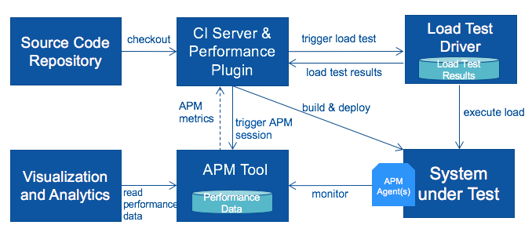
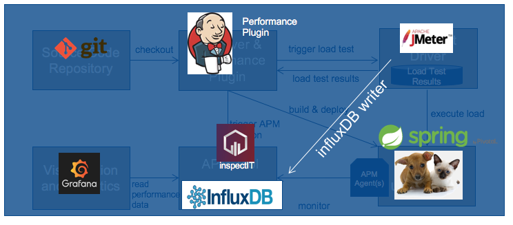

# Performance Regression Testing Demo

## Abstract
Principal setup of our Performance Regression Testing Demo (Architectural View):


Principal setup of our Performance Regression Testing Demo (Tool View):


We will use the following tools in this demo:
- Git
- Jenkins
- JMeter
- InfluxDB
- InspectIT
- Grafana
- Spring Petclinic Microservices

# 1.0 Installation and Setup
## 1.1 Windows

### 1.1.1 Precondition
#### Java JDK
To run this demo you need to have installed at least Java JDK 1.7 or 1.8. Please make sure you have installed a Java Development Kid (JDK) and not a Java Runtime Environment (JRE). Java 9 is not yet supported by some tools and should be avoided to avoid complications.  

#### Maven
Go to https://maven.apache.org/downoad.cgi and download the latest Maven version. Unzip and move the directory to your favorite installation directory.  
To make the command `mvn` accessible to Jenkins you have to add the installation directory to your path variable.  
To do that open the `Advanced System Settings` page and click on `Environment Variables`. Now depending on your Windows version add the Maven bin folder to the Path variable.  
As a last step we need to set the `JAVA_HOME` variable to the installation directory of your Java JDK. To do that open the `Advanced System Settings` page and click on `Environment Variables`. Now add a new System Variable called `JAVA_HOME` and set it to the installation directory of your JDK.  
Now when you open the Command Prompt you should be able to run the command `mvn`.

#### Git
Download and install git from https://git-scm.com/downloads.

#### CUrl
Download and extract the `Win64 - Generic` CURL application from https://curl.haxx.se/download.html. Copy the directory to your favorite installation directory and add the directory to your system path variable.  
To do that open the `Advanced System Settings` page and click on `Environment Variables`. Now depending on your Windows version add the `curl` folder to the Path variable.  

### 1.1.2 Jenkins
#### Installation
Download and install Jenkins for Windows from https://jenkins.io/download.

#### Configuration
As the System Under Load (SUT) already uses port 8080 we have to change the default port from Jenkins to some other port like 8090. For that change to the installation directory of Jenkins and change the port in the `jenkins.xml`.

#### Start Jenkins
Open up the Task Manager and go to Services. Search for the service Jenkins and start it.  
Jenkins should now be accessible from http://localhost:8090.

#### Install required plugins
Go to the available plugins page (http://localhost:8090/pluginManager/available) in Jenkins and install the following two plugins:

- Performance Plugin
- Parameterized Trigger Plugin

#### Import Jobs
There are two jobs in this repository which have to be imported into Jenkins by copy pasting the folders into `jenkins_home/jobs`. After copying the jobs you have to restart Jenkins with `docker restart jenkins`. Afte restaring Jenkins you should now be able to see the following two new jobs in the Jenkins job overview:

- spring-pet-clinic CI load test
- spring-pet-clinic-cleanup

### 1.1.3 JMeter
Download the latest JMeter from http://jmeter.apache.org/download_jmeter.cgi.  
Unzip and move the downloaded folder to your favorite installation directory.  
To start the JMeter UI change to the `bin` directory and double-click on `jmeter.bat`.

#### InfluxDB Writer
In order to use JMeter with the InfluxDB we have to install the JMeter InfluxDB Writer which can be downloaded from https://github.com/NovaTecConsulting/JMeter-InfluxDB-Writer/releases.  
Download the latest jar and copy the file into the installation directory of JMeter in `lib\ext\`

#### Add to Path Variable
In order to run the load test in Jenkins you have to add the JMeter executable to the Path variable. To do that open the `Advanced System Settings` page and click on `Environment Variables`. Now depending on your Windows version add the JMeter bin folder to the Path variable.

### 1.1.4 InfluxDB
Download InfluxDB for Windows from https://portal.influxdata.com/downloads and move the unzipped folder to your favorite installation directory.
To start InfluxDB double-click on `influxdb.exe`.

### 1.1.5 Grafana
Download Grafana for Windows from https://grafana.com/grafana/download and move the unzipped folder to your favorite installation directory.  
To start Grafana change to the `bin` directory and double-click on the `grafana-server.exe`.

### 1.1.6 InspectIT
Go to http://www.inspectit.rocks/ and download the latest InspectIT version for your operating system.
Start the installation process by executing the `jar` file.  
Select your preferred installation directory and install all available components.

#### Start InspectIT CMR
Change into `CMR` directory and double-click on the `startup.bat` script.

#### Start InspectIT UI
Change into the `inspectit` directory and double-click on the `inspectit.exe` file.

#### Configure InspectIT
Start the InspectIT UI and open the Analyze Perspective.
##### Configure Local CMR
Right click on the Local CMR and click on `Configure Repository`. Switch to the Database section and enable the write data to influxDB.

##### Import PetClinic profile
Switch to the Configuration Interface Perspective. Now right click on the Local CMR and click on Import Configuration. Select and import the `petClinic_Profile.xml` located in the directory `Inspectit`.

##### Import Business Context
Replace the `businessContext.xml` in the `CMR\ci` directory with the one from `InspectIT`.

After that restart `InspectIT CMR`.

## 1.2 Docker (Unix Systems)
Install docker and docker-compose on your system if not already installed.
Please consult the docker documentation to find out how to install docker
on your system: https://docs.docker.com/engine/installation/  
Please see https://docs.docker.com/compose/install/ to find instructions
for your platform to install docker-compose.

### 1.2.1 Configure Docker
Before we can start the docker containers we have to adjust the computing resources dedicated to docker by going to the preferences page of docker. That is necessary as building and running all microservices consumes a lot of memory. So we should set the memory to at least 10GB and assign as many CPU Cores as possible.
### 1.2.2 Docker Compose
To start the entire Demo check out this project and go inside the `Docker` directory where you can find the `docker-compose.yml` file. To start the entire demo just execute the `./start_all.sh` script.

This will start the following docker containers on your system:

- jenkins
- influxdb
- inspectit_cmr
- grafana

To see logs about one container use `docker logs -f <container-name>`.

#### 1.2.3 Stop and Remove
To stop all containers and remove them use the `stop_all.sh` script.

#### 1.2.6 Cleanup
To clean up the docker caches and remove all unused containers use
`docker system prune -a`.

#### 1.2.7 Install InspectIT UI
Go to http://www.inspectit.rocks/ and download the latest InspectIT version for your operating system.
Start the installation process by executing the `jar` file.
Select your preferred installation directory. You are only required to install the `inspectIt UI` as the
other two components will run inside the docker containers.

##### Import PetClinic profile
Switch to the Configuration Interface Perspective. Now right click on the Local CMR and click on Import Configuration. Select and import the `petClinic_Profile.xml` located in the directory `InspectIT\`.

# 2.0 Tool Configuration
## 2.1 Grafana
Grafana can be accessed by going to http://localhost:3000 in your browser. To login use the default `admin` user with the default password `admin`.
The next step is to setup Grafana

#### 2.1.1 Automatic setup with Python script
Install Python3 on your system and change to the `Grafana` directory.
To install all necessary python modules run the `python3 setup.py install` script.
After that you can start the setup script by running `python3 setup_grafana.py`.
This will add all necessary datasources and imports all necessary dashboards.

#### 2.1.2 Manual Setup with UI
##### Add Data Source
Add two datasources `JMeter` and `InspectIT`.
###### JMeter
Click on the add data source icon and enter `JMeter` as name for this datasource. Next select the `InfluxDB` from the available database types list.
For the HTTP settings select http://localhost:8086 as your datasource URL and use `direct` as access method.
We can skip the rest and go directly to the InfluxDB Details section where we will enter `jmeter` as Database and `admin` as user and password. Click on Save and Test and a green message should appear that the datasource is working.

###### InspectIT
Click on the add data source icon and enter `InspectIT` as name for this datasource. Next select the `InfluxDB` from the available database types list.
For the HTTP settings select http://localhost:8086 as Docker as your datasource URL and use `direct` as access method.
We can skip the rest and go directly to the InfluxDB Details section where we will enter `inspectit` as Database and `admin` as user and password. Click on Save and Test and a green message should appear that the datasource is working.

##### 2.1.2 Installing Dashboards
Next we are going to import some Dashboards we need to see live JMeter data and InspectIT data. To do so go to the dashboard import page ( http://localhost:3000/dashboard/new?editview=import&orgId=1)
and import the following two dashbards:

- https://grafana.com/dashboards/1152  
Select `JMeter` as datasource
- https://grafana.com/dashboards/1691  
Select `InspectIT` as datasource

Additional useful dashboards for `InspectIT` can be downloaded and installed from https://github.com/inspectit-labs/dashboards

## 2.3 Jenkins
Go to http://localhost:8090 in your browser to open up the Jenkins web interface.
You will have access to one project which is called `spring-pet-clinic-ci-load-test-docker`
and will checkout the Pet Clinic project and starts a load test by using JMeter.

### 2.3.1 Start load test
Go to http://localhost:8090/job/spring-pet-clinic-ci-load-test-docker/ and click on `Build with parameters` to start a new build with a load test.  
Configure the build depending on your system and click on `Build`.

### 2.3.2 Console Output
To follow the build and load test progress go inside the current build and click on `Console Output`.

## 2.4 PetClinic
If everything goes well, you can access the following services at given location:
* Discovery Server - http://localhost:8761
* Config Server - http://localhost:8888
* AngularJS frontend (API Gateway) - http://localhost:8080
* Customers, Vets and Visits Services - random port, check Eureka Dashboard
* Tracing Server (Zipkin) - http://localhost:9411
* Admin Server (Spring Boot Admin) - http://localhost:9090

## 2.4.1 Simulate Delay
To introduce some sort of delay and see the impacts on the performance regeression test you can add the following piece of code to the `findAll` method of the OwnerResource which you can find at
`spring-petclinic-customers-service/src/main/java/org/springframework/samples/petclinic/customers/web/OwnerResource.java`:

```
try {
  Thread.sleep(500);
} catch (Exception e) {
  e.printStackTrace();
}
```
This will add 500 milliseconds of delay to the `getAllOwners` business transaction.
As a side note you shouldn't increase the delay over 1 second otherwise a timeout of the database transaction will occur.